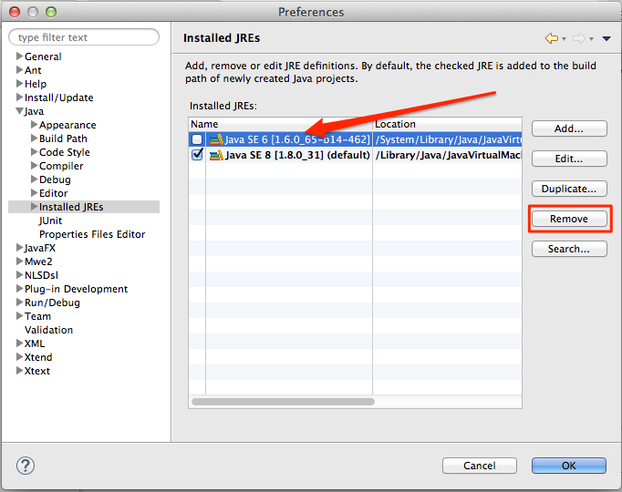
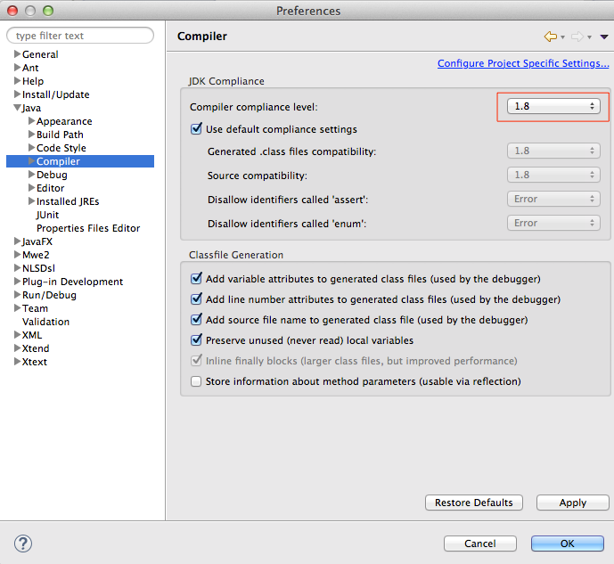
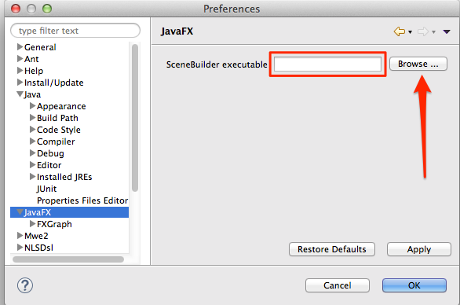

#Getting Started

Lets get started on our application, we will take it step by step and get started with getting the development environment set correctly so that eclipse knows where the jdk is and also where source builder lives.

##Eclipse setup 

Presuming you have downloaded all the software and installed it correctly (links in Lab-01) We need to tell Eclipse to use JDK 8 and also where it will find the Scene Builder:

- Open the Eclipse Preferences and navigate to Java | Installed JREs.

- Click Add..., select Standard VM and choose the installation Directory of your JDK 8.

- Remove the other JREs or JDKs so that the JDK 8 becomes the default.

*Preferences - Java - Installed JREs.*

*Preferences - Java - Complier.*

- Navigate to the JavaFX preferences. Specify the path to your Scene Builder executable.

*Preferences - JavaFX*

#Helpful Links

-[JavaDoc](http://docs.oracle.com/javase/8/docs/api/) for the standard Java classes
-[JavaDoc](http://docs.oracle.com/javase/8/javafx/api/) for JavaFX classes
-[Official JavaFX Tutorials](http://docs.oracle.com/javase/8/javafx/get-started-tutorial/get_start_apps.htm) by Oracle

