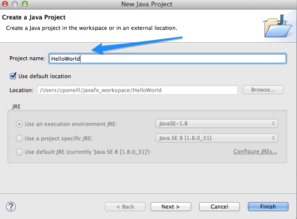

#Hello World

A ["Hello, world!"](http://www.thehelloworldprogram.com/) program has become the traditional first program that many people learn. In general, it is simple enough so that people who have no experience with computer programming can easily understand it, especially with the guidance of a teacher or a written guide.

##Create the Application

- Create a new JavaFX Project by selecting File, and then choosing New and then Other.

- In the New wizard, expand the JavaFX folder and choose JavaFX Project. Click Next.

- In the New Java Project dialog box, enter HelloWorld for the Project Name

HelloWorld

- In the Details section of the Java Settings dialog box, click Link additional source option. The Link Source dialog box is displayed.

- Click Browse and navigate to the location of the src folder for the Scene Builder HelloWorld sample application and click OK

