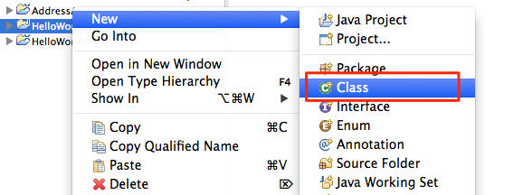
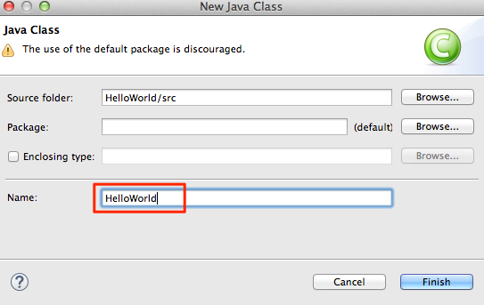

#Hello World

A ["Hello, world!"](http://www.thehelloworldprogram.com/) program has become the traditional first program that many people learn. In general, it is simple enough so that people who have no experience with computer programming can easily understand it, especially with the guidance of a teacher or a written guide.

##Create the Application

- Create a new JavaFX Project by selecting File, and then choosing New Project.

- In the New Java Project dialog box, enter HelloWorld for the Project Name

HelloWorld

- In the package explorer window (on the left), click on the HelloWorld Project and right click (ctrl+click on the mac) and create a new class calle HelloWorld

- Call this new Class HelloWorld and click finish (take all te defaults)

- Now you will have a java programm called HelloWorld.java in your 
